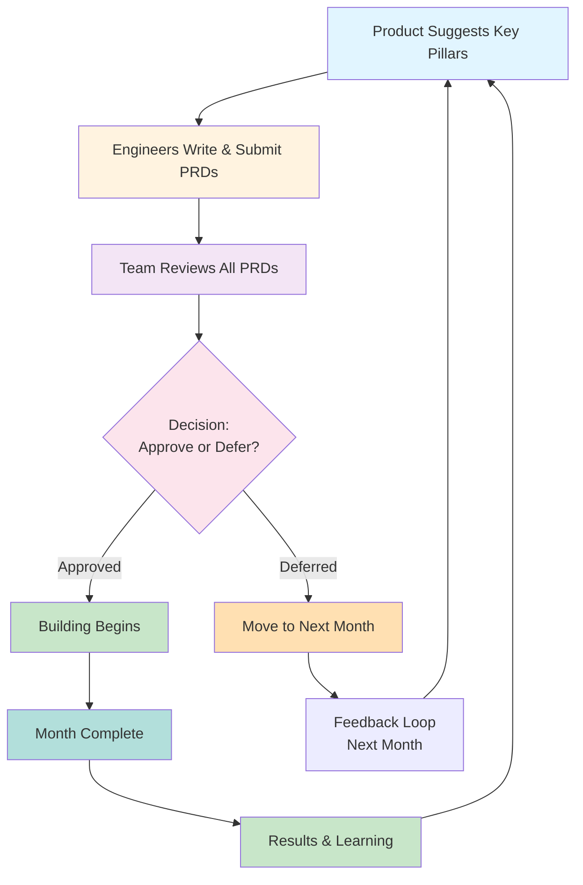

About a month ago, I made a deliberate choice: to give my engineers agency in what we build. Not because I didn't trust my own judgment, but because I knew they were hungry to feel ownership over the work. They wanted to have a voice in deciding what was worth building and what wasn't. They wanted to feel like they were steering the ship, not just rowing it.

So I created a process that would let them do that. That would give them permission, structure, and the tools to act on the instincts they already had.

## Why This Happened

About forty percent of my team spent the last year without a stable product manager helping guide them. They did what good engineers do when there's a vacuum: they figured it out themselves. They pitched ideas, iterated, made decisions. They got comfortable with the process.

Then we transitioned. My team, which had been focused on building core product, shifted to also owning growth work. Thirty percent of the team had already been doing growth work, they knew the rhythms, the metrics, the patterns. The rest of us had to learn a new language entirely.

We had to learn the funnel. We had to learn to use tools like Enterpret to get a sense of what our customers were telling us, though Enterpret skews heavily toward enterprise customers, so it gave us a vague picture at best. For our small Foundation plan customers, we had to lean on the instincts we had built from working with them directly. We had to shift from thinking "this is what makes a good product" to asking "how do we get people to understand the value in what we are offering."

It was a lot. And I realized pretty quickly that if I tried to be the bottleneck for all of this, the person who writes the PRDs, decides what gets prioritized, decides what gets built, we were going to move incredibly slowly. We'd lose the insights that my engineers were already developing. We'd waste their instincts.

## The Experiment

So we moved from quarterly planning to monthly planning, just for our team. And we opened up the PRD-writing process.

A PRD, or Product Requirements Document, is just a structured way to propose an idea. It's the artifact we use to say: here's what I think we should build, here's why, and here's how I think we should do it.

Every month, any engineer can submit a PRD for something they think we should build. It doesn't have to be fully fleshed out. But it has to follow a structure: context, hypothesis, approach, and most importantly, a t-shirt size estimate early in the process.

We review them together on a monthly cadence. Everyone reads everyone else's PRD. We talk through them. We push back. We refine. Then we commit to what we're building that month.

In April, our first month, we got 21 PRDs.

I panicked a little bit.

## Learning to Say No Faster

21 PRDs was too many to unpack, too many to vote on, too many to choose from. We realized pretty quickly that having more ideas than we could possibly act on was actually the problem we wanted to have, but only if we could say no intelligently and quickly.

So we changed the process slightly. Now, a few weeks before the monthly PRD review, product suggests key pillars we should focus on. "This month, we're thinking about retention and onboarding," for example. "Or, we're trying to fix churn in our early-stage segment."

Engineers still write PRDs on anything they want. But having those pillars makes it easier to evaluate: does this PRD ladder up to something we're trying to achieve? If not, that doesn't mean it's a bad idea. It might just mean it's not the right month.

The data backs this up. In April we said yes to 12 PRDs, and only 8% of those were written by engineers. In May, even with pillars in place, the team submitted 29 new PRDs, more than we got all of April. We said yes to 10 of them, and 30% were written by engineers. The creativity and excitement did not slow down at all. But the quality and targeting of what was being submitted got sharper. Engineers were learning the funnel, learning what we were trying to drive toward, and writing PRDs that fit what the team actually needed in that moment. The pillars did not limit them, they focused them.

## Size Matters

Every PRD comes with a t-shirt size estimate: small, medium, large. If something is coming in as large, we spike it. We spend a few days figuring out if that size estimate is actually right.

And then comes the hard part: if it's actually large, we make a decision. We can descope it, break it into smaller pieces and do this month's slice. We can rework it, redesign it to be smaller. Or we can drop it entirely.

This sounds harsh, but it's the most important part of the whole process. We have limited time and energy. We can't do it all. So we force the decision upfront, before anyone's spent weeks building something that doesn't fit in our capacity.

It keeps us moving. It keeps us focused on high-value work. It means we're not dragging half-finished things into next month just because we didn't want to kill them.

## The Ones That Don't Make It

If a PRD doesn't get picked up in the month it's submitted, it moves to the next month. It stays in the pile. Sometimes it gets picked up the next month. Sometimes it loses relevance and we let it go. Sometimes it sticks around because it's a good idea that just keeps being less urgent than something else.

The important thing is: it doesn't disappear. The engineer doesn't feel like their work was wasted. The team knows it's there. Maybe next month it'll be the thing we need.

## Tech Debt Gets a Voice

I'm also part of this process, and not just as a cheerleader. I write PRDs too. Specifically, I write tech debt PRDs.

We were living in that classic engineer trap: everything's getting slower, the codebase is harder to work in, but we keep shipping features because that's what gets measured. So I'm being deliberate about it. I write PRDs for the tech debt work I think we need to do. I put them in the same monthly review. I push for them to get picked.

Right now, tech debt is about ten percent of our capacity. I want it to be twenty percent. It's going to take a few more months of me being annoying about it, but I'm going to get there.

## Why This Works

Honestly, I think it works because we're actually leveraging what we have: engineers who are smart about our customers, who have good instincts, and who want to see their ideas come to life.

The monthly cadence matters too. We can react quickly when something's working. We can kill something fast when it's not. We don't have to live with a quarterly plan that looked good in theory but fell apart in practice.

But mostly, I think it works because we stripped away the bullshit. We didn't hire a person to write PRDs. We didn't create more process. We just said: here's what a PRD looks like, here's how we'll review them together, here's how we'll decide. And then we got out of the way.

The engineers are better at this than the engineering, product, and design leaders alone would have been anyway.
